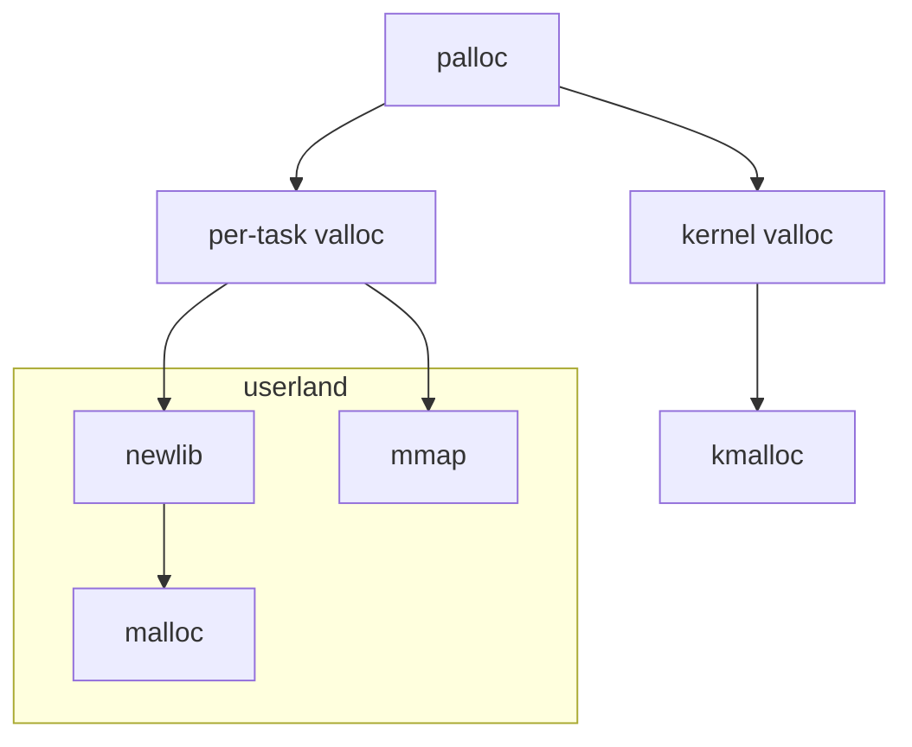

# Memory



At the top, there is palloc which allocates physical pages in the RAM. These pages can then be mapped into the address space of the kernel or userland tasks using valloc.

The userland standard library will then use these page allocations for calls to `malloc()` and `mmap()`.

In kernel space, there is also a memory allocator called `kmalloc()` which can be used for short-term, variable-sized allocations that will only be used in kernel space.


## Virtual page allocator (valloc)

Xelix has completely dynamic virtual memory in kernel and user space (with some exceptions).

## Physical page allocator

Physical memory is allocated using a page allocator (`mem/palloc.c`). It is the fastest method of memory allocation in Xelix, but has two significant limitations: It can only allocate full pages (4KB on x86), and it does not keep information on the size of allocations. Due to this, to free an allocation, the size needs to be supplied as well.

It is best suited for large, long-term allocations where the size is fixed or stored in a side channel, or for allocations that need to align to page boundaries anyway (like task memory).

```c
#include <mem/palloc.h>

// Allocate `num_pages` physical pages.
void* mem = palloc(num_pages);

// Free `num_pages` physical pages at `page_id`.
pfree(num_pages, page_id);
```

## Kernel-internal memory (kmalloc)

kmalloc is the internal memory allocator of the kernel. It is used for small allocations (smaller than one page, generally) that will have to be freed again at some point. Memory allocated using kmalloc should never be used in task address space.

```c
#include <mem/kmalloc.h>

// Allocate memory
void* mem = kmalloc(size);

// Allocate memory and initialize it to zeros
void* mem = zmalloc(size);

// Free allocated memory
kfree(mem);
```

kmalloc can optionally be compiled with checks for out-of-bounds writes/memory overflows. This works by placing canary values before and after each allocation and checking them on calls to `free()`. This option should only be enabled for debug builds due to the performance penalty it incurs.

## Kernel binary

The Xelix kernel is currently always located at 0x100000 in both physical memory and the kernel virtual address space.

### Userland-mapped parts of the kernel binary: UL_VISIBLE()

For security reasons and to keep the address space from being cluttered, the kernel binary is not mapped into task virtual address space.

This presents an issue during interrupts and context switches -- While the CPU switches us back to Ring 0 as soon as the interrupt handler is called, we will still be in the paging context of the task until we manually switch it. But the interrupt handler and more importantly the variable which contains the correct paging context to restore are in kernel memory and thus would be inacessible before the switch.

To solve this chicken-and-egg problem, Xelix has a macro called `UL_VISIBLE`, which can be used to mark variables and functions for mapping into userspace/task memory. This is accomplished by placing these into a different ELF section by the linker script.

```c
void* vmem_kernel_hwdata UL_VISIBLE("bss");
```
